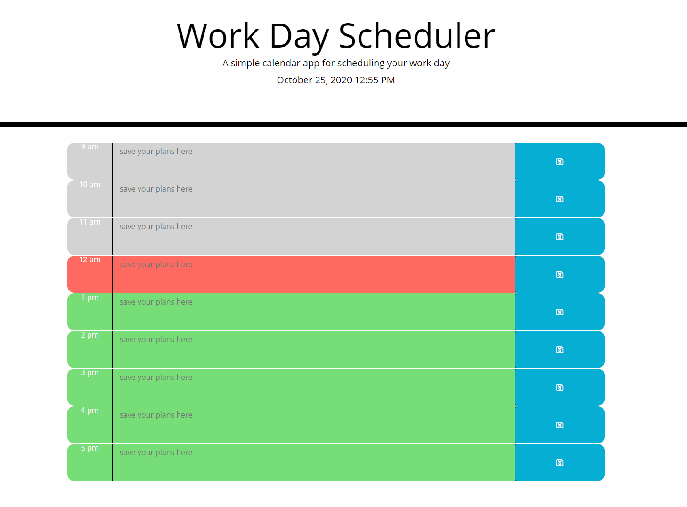

# dayPlanner

### Table of Contents:

- [User Story](##-User-Story)
- [Description](##-Description)
- [Installation](##-Installation)
- [Credits](##-Credits)
- [Contributors](##-Contributors)
- [License](##-License)

## Deployed site

[Live Site](https://enevarez-ops.github.io/dayPlanner/)

## User Story

AS AN employee with a busy schedule
I WANT to add important events to a daily planner
SO THAT I can manage my time effectively

## Description

Description of Website and what technologies were used

## Installation

Run on Default Browser

## Contributors

Efrain Nevarez

## Credits

CSS, HTML, JQuery, Bootstrap

## License

This project is licensed by MIT
